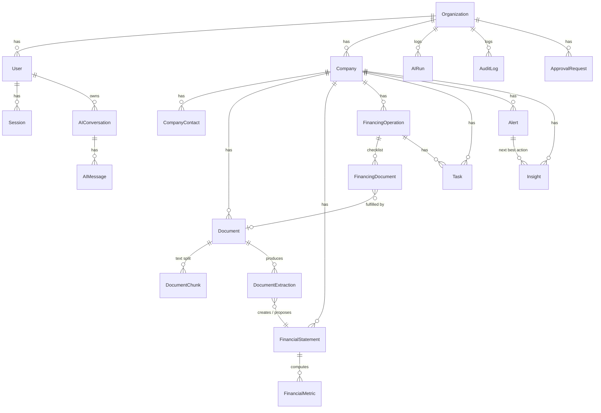

# Data model

Sorgente di verità: [`prisma/schema.prisma`](../prisma/schema.prisma).

## Convenzioni

- Ogni entità: `id` (cuid), `createdAt`, `updatedAt`.
- Ogni entità di dominio ha `organizationId` (tenant), anche le entità figlie: l'isolamento è un filtro `where organizationId` su ogni query, senza join.
- Importi: `Decimal(18,2)` in EUR. Nel financial engine vengono convertiti in `number` (precisione più che sufficiente per importi < 10^15) e i risultati arrotondati.
- Tassi: percentuale `Decimal(7,4)` (es. `4.2500` = 4,25%).
- Eliminare un'azienda elimina a cascata documenti, bilanci, metriche, operazioni, task, alert, insight e conversazioni.

## Diagramma

## Entità

| Entità | Scopo | Note chiave |
|---|---|---|
| **Organization** | Tenant (studio di consulenza) | `settings` JSON: soglie alert (DSCR min, PFN/EBITDA max, giorni scadenza) |
| **User** | Utente | `role`: OWNER / ADVISOR / ANALYST |
| **Session** | Sessione login | solo hash SHA-256 del token |
| **Company** | Azienda cliente | anagrafica, consulente assegnato, stato |
| **CompanyContact** | Referenti azienda | |
| **Document** | File PDF caricato | `type` + `typeSource` (USER/RULES/AI) + confidenza, `status`, `processingLog` per step, testo estratto |
| **DocumentChunk** | Testo per pagina | base per `search_company_knowledge` (full-text Postgres), pronto per embeddings |
| **DocumentExtraction** | Risultato strutturato dell'estrazione | `method` (AI/RULES/MANUAL/SEED), `data` con **fonte per campo** (pagina, testo), `validation`, `status` di revisione, `appliedAction` |
| **FinancialStatement** | Bilancio normalizzato per anno | `status` EXTRACTED → VERIFIED; `fieldSources` collega ogni valore al documento sorgente |
| **FinancialMetric** | Ratio calcolato per bilancio | `value` null se non disponibile, `status` OK/MISSING/NOT_MEANINGFUL, `formula`, `inputs` |
| **FinancingOperation** | Operazione finanziaria | stato pipeline (Lead → Completed/Rejected), banca, importo, debito residuo, tasso, scadenza, probabilità |
| **FinancingDocument** | Voce di checklist documentale | MISSING / REQUESTED / RECEIVED / VERIFIED, scadenza, documento collegato, task |
| **Task** | Attività | `source` (MANUAL/AI/BRIEFING/ALERT/CHECKLIST), priorità, stato, scadenza, assegnatario |
| **Alert** | Condizione rilevata da regola deterministica | `dedupeKey` univoco per (regola, sorgente); auto-risoluzione |
| **Insight** | Output interpretativo | `kind`: VARIATION, FINANCIAL_INTERPRETATION, CLIENT_BRIEFING, NEXT_BEST_ACTION, OPERATION_SUMMARY, DAILY_BRIEFING, DOCUMENT_INSIGHT; `source` RULES/AI; `sourceRefs` |
| **AIConversation / AIMessage** | Chat copilot | contesto azienda opzionale; tool call e fonti per messaggio |
| **AIRun** | Ogni invocazione LLM | provider, modello, input, output, token, durata, errore |
| **ApprovalRequest** | Azioni AI che richiedono approvazione umana | CREATE_TASK (priorità alta), UPDATE_FINANCIAL_STATEMENT (estrazione su bilancio già verificato) |
| **AuditLog** | Tracciamento | `actorType` USER/AI/SYSTEM, `action`, `entityType`, `entityId`, `toolName`, `aiRunId`, `metadata` (per l'AI: input/output del tool) |

## Campi del bilancio normalizzato

| Campo | Italiano | Fonte tipica (schema CEE) |
|---|---|---|
| `revenue` | Ricavi | A.1 Ricavi delle vendite e delle prestazioni |
| `ebitda` | EBITDA / MOL | Differenza A−B + B.10 Ammortamenti e svalutazioni |
| `ebit` | EBIT / Risultato operativo | Differenza tra valore e costi della produzione (A−B) |
| `netIncome` | Utile (perdita) | 21) Utile (perdita) dell'esercizio |
| `cash` | Disponibilità liquide | C.IV Totale disponibilità liquide |
| `financialDebt` | Debiti finanziari | D.4 Debiti verso banche + D.5 altri finanziatori + D.1/D.2 obbligazioni |
| `netFinancialPosition` | PFN | Debiti finanziari − Disponibilità liquide |
| `equity` | Patrimonio netto | A) Totale patrimonio netto |
| `currentAssets` | Attivo corrente | C) Totale attivo circolante |
| `currentLiabilities` | Passivo corrente | Debiti esigibili entro l'esercizio successivo |
| `inventory` | Rimanenze | C.I Totale rimanenze |
| `totalAssets` | Totale attivo | Totale attivo |
| `interestExpense` | Oneri finanziari | C.17 Interessi e altri oneri finanziari |
| `principalRepayment` | Quota capitale annua | Nota integrativa / piano di ammortamento |
| `depreciation` | Ammortamenti | B.10 Ammortamenti e svalutazioni |
